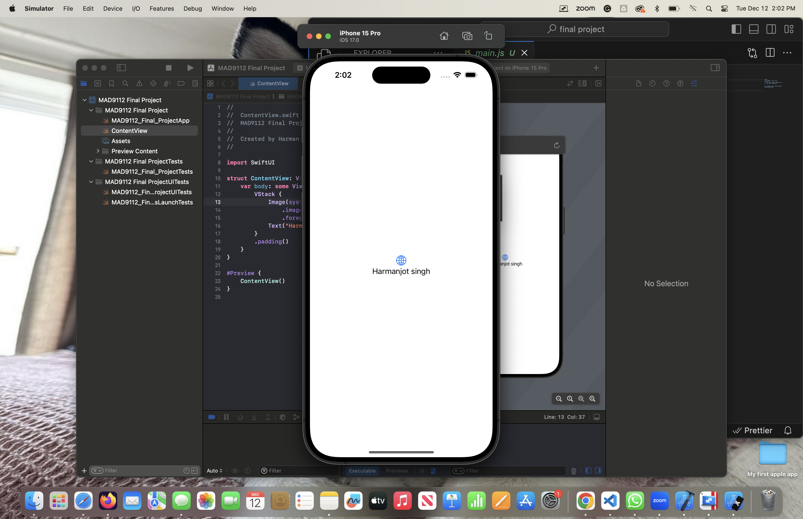
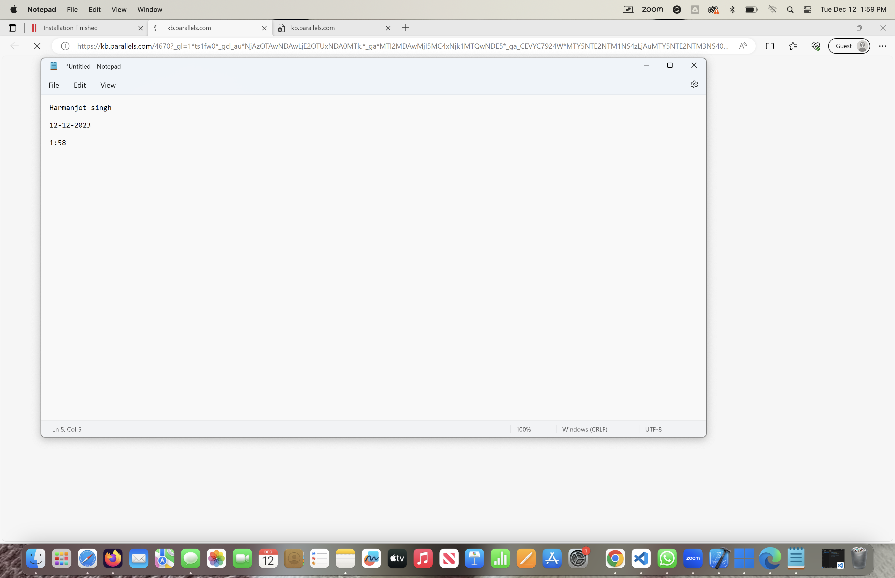

//create array of no.s
step=1
const numbers = [1,2,3,4,5]
let sum = 0
for (let i=0; i<numbers.length; i++) {
    sum = sum + numbers[i]
}

const average = sum / numbers.length
console.log(average)

